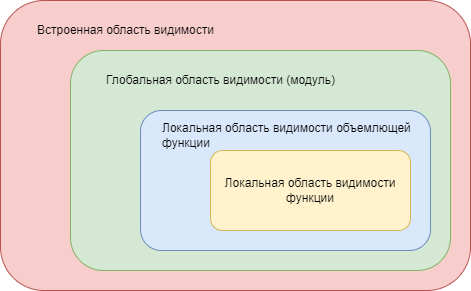

## Области видимости
**Область видимости** - место, где определена переменная в коде. Имена в python 
начинают свое
существование с момента присваивания им какого-то значения.  

В Python можно выделить четыре области видимости:
* L (Local) - локальная область видимости
* E (Enclosing) - область видимости охватывающих функций
* G (Global) - глобальная область видимости, или область видимости модуля
* B (Built-in) - встроенная область видимости

В примере видим переменную `x` , объявленную дважды: просто в модуле и внутри 
функции `func`. Если
запустить код, то в консоль будет напечтано 50. Интерпретатор взял значение переменной `x` из глобальной
области видимости и вывел его.

Правило, которое описывает механизм поиска имен в областях видимости называется правилом LEGB:
>Когда внутри функции оказывается неуточненная переменная, Python ищет ее максимум в четырех местах - в локальной области видимости, затем в локальных областях видимости объемлющих функций, далее в глобальной области видимости, и, наконец, во встроенной области видимости. Поиск останавливается в первом же месте, где обнаруживается имя. Если имя не будет найдено ни в одной из областей, тогда Python сообщит об ошибке.  

Визуально, вложенность областей видимости можно проиллюстрировать таким образом.



Поиск начинается от желтой области и идет в красную.  

Отдельного упоминания заслуживает встроенная область видимости. На самом деле ее представляет просто
еще один модуль из стандартной поставки Python. Модуль , внезапно, называется builtins :). Он импортируется
так же, как и любой другой модуль. Взглянем, что же у него внутри:

```python
>>> import builtins
>>> dir(builtins)
['ArithmeticError', 'AssertionError', 'AttributeError', 'BaseException',
'BlockingIOError', 'BrokenPipeError', 'BufferError', 'BytesWarning',
'ChildProcessError', 'ConnectionAbortedError', 'ConnectionError',
...
'ConnectionRefusedError', 'ConnectionResetError', 'DeprecationWarning', 'EOFError',
'issubclass', 'iter', 'len', 'license', 'list', 'locals', 'map', 'max',
'memoryview', 'min', 'next', 'object', 'oct', 'open', 'ord', 'pow', 'print',
'property', 'quit', 'range', 'repr', 'reversed', 'round', 'set', 'setattr', 'slice',
'sorted', 'staticmethod', 'str', 'sum', 'super', 'tuple', 'type', 'vars', 'zip']
```

Видим кучу имен исключений и различные зарезервированные слова python. И нам ничего не мешает
переопределить их. Мы можем, например, переопределить sum и сделать ее именем переменной, а не
встроенной функции. Это возможно из-за правила LEGB. Обычно, такое переопределение является плохой
практикой. Но знать о такой возможности как минимум полезно. Приведем простой пример:

```python
print = 5
print("Hello")

# TypeError: 'int' object is not callable
```

Вернемся к примеру кода выше с переменной x . Есть ли какая-нибудь возможность получить значение x
из локальной области видимости функции, а не из глобальной? Конечно, Python - очень демократичный язык.

<details><summary>Что погуглить дополнительно?</summary>
  * Variable shadowing
</details>
